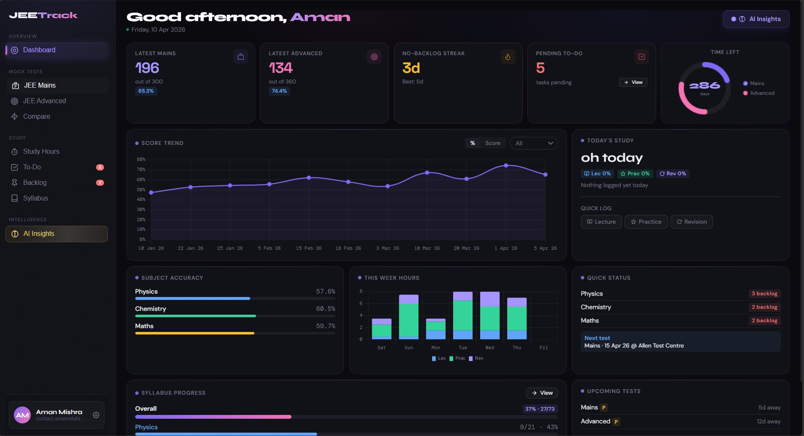
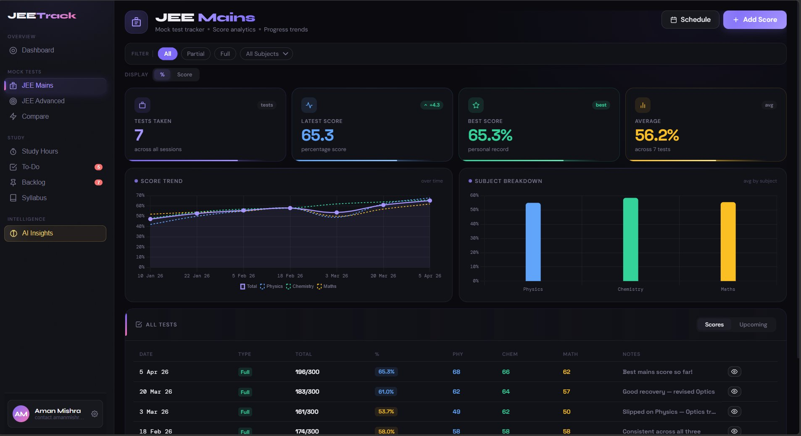
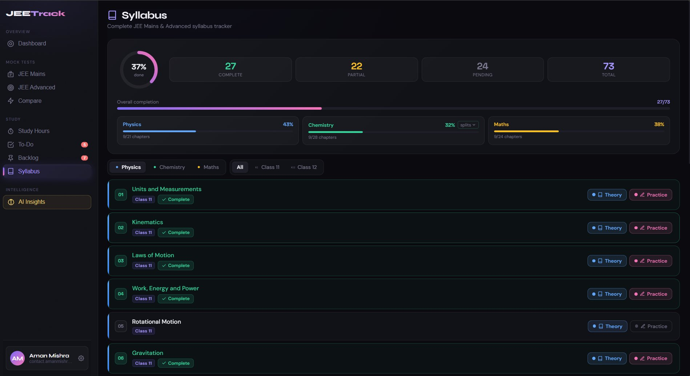
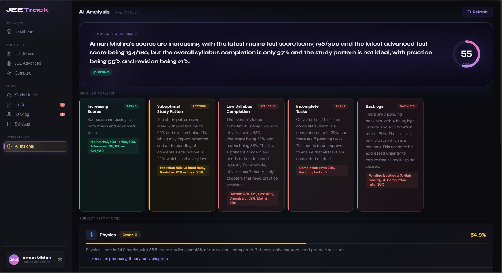
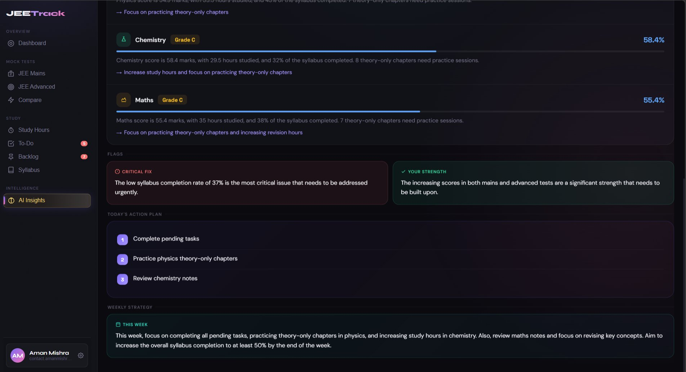

<div align="center">


# JEETrack

**The all-in-one preparation tracker for JEE 2026 / 2027 aspirants**

[](https://jeetrack.vercel.app)
[](https://supabase.com)
[](https://groq.com)
[](https://web.dev/progressive-web-apps/)
[](LICENSE)

<br/>

> Track study hours · Analyse test scores · Crush the JEE syllabus — with AI-powered insights running at **lightning speed** via Groq.

<br/>



<p align="center">
  
  
</p>

<p align="center">
  
  
</p>

</div>

---

## ✨ Features

| Feature | Description |
|---|---|
| 📊 **Dashboard** | Daily study tracking, subject-wise progress rings, streak system |
| 📝 **Test Tracker** | Log JEE Mains / Advanced mock scores with trend analytics |
| 📚 **Syllabus Tracker** | Topic-level coverage for Physics, Chemistry & Maths |
| 🗂️ **Backlog Manager** | Surface and clear weak topics before exam day |
| 🤖 **AI Insights** | Personalised coaching analysis powered by **Groq (LLaMA 3.3 70B)** — responses in under 1 second |
| 📧 **Monthly Reports** | Automated PDF report card via Supabase Edge Functions + Resend |
| 📱 **PWA** | Installable on Android & iOS; works fully offline |
| 🔔 **Push Notifications** | Daily study reminders via service worker |

---

## 🛠 Tech Stack

```
Frontend   →  Vanilla HTML · CSS · JavaScript  (zero framework overhead)
Database   →  Supabase (PostgreSQL + Row Level Security)
Auth       →  Supabase Auth
AI Engine  →  Groq API  (LLaMA 3.3 70B Versatile, ~0.5 s latency)
Functions  →  Supabase Edge Functions  (Deno / TypeScript)
Email      →  Resend API
Charts     →  Chart.js
PDF        →  jsPDF + html2canvas
Hosting    →  Vercel
Cron       →  pg_cron  (Supabase)
```

---

## 📁 Project Structure

```
jeetrack/
├── frontend/                     # Static PWA — deployed to Vercel
│   ├── index.html                # App markup
│   ├── styles.css                # All styles
│   ├── app.js                    # All application logic
│   ├── manifest.json             # PWA manifest
│   ├── sw.js                     # Service worker (offline + push)
│   ├── vercel.json               # Vercel SPA rewrite config
│   ├── icon-192.png
│   └── icon-512.png
├── supabase/
│   └── functions/
│       ├── ai-insights/          # Edge function — Groq AI analysis
│       │   └── index.ts
│       └── monthly-report/       # Edge function — monthly email + PDF
│           └── index.ts
├── supabase-schema.sql           # Full database schema
├── migration.sql                 # DB migrations
├── onboarding-trigger.sql        # Onboarding automation trigger
└── README.md
```

---

## 🚀 Quick Start

### 1 · Clone the repository

```bash
git clone https://github.com/contactamanmishra76-blip/JEETrack.git
cd JEETrack
```

### 2 · Set up Supabase

1. Create a project at [supabase.com](https://supabase.com)
2. Open **SQL Editor** and run `supabase-schema.sql`
3. Run `migration.sql` and `onboarding-trigger.sql`
4. Copy your **Project URL** and **anon key** from **Settings → API**

### 3 · Configure the frontend

Open `frontend/app.js` and fill in your credentials at the top:

```js
const SUPABASE_URL = 'https://your-project.supabase.co';
const SUPABASE_ANON_KEY = 'your-anon-key';
```

### 4 · Deploy to Vercel

1. Push the repo to GitHub (see the [Git Push Guide](#-git-push-guide) below)
2. Go to [vercel.com](https://vercel.com) → **Add New Project**
3. Import your GitHub repository
4. Set **Root Directory** to `frontend`
5. Click **Deploy** — done ✅

The `frontend/vercel.json` already handles SPA rewrites:

```json
{
  "rewrites": [{ "source": "/(.*)", "destination": "/index.html" }]
}
```

### 5 · Deploy Supabase Edge Functions

```bash
# Install Supabase CLI if needed
npm install -g supabase

# Login and link project
supabase login
supabase link --project-ref your-project-ref

# Set secrets
supabase secrets set GROQ_API_KEY=gsk_your_groq_key
supabase secrets set APP_URL=https://your-app.vercel.app

# Deploy AI insights function
supabase functions deploy ai-insights

# Deploy monthly report function (optional)
supabase secrets set RESEND_API_KEY=re_your_resend_key
supabase secrets set FROM_EMAIL=reports@yourdomain.com
supabase functions deploy monthly-report
```

---

## 🤖 AI Insights — How It Works

AI insights are powered by **Groq's inference API** running **LLaMA 3.3 70B Versatile** — one of the fastest open-weight models available. The Groq API key never touches the browser; all calls go through the Supabase Edge Function which:

1. Verifies the user's Supabase session token
2. Constructs a JEE coaching prompt from the user's study data
3. Calls `https://api.groq.com/openai/v1/chat/completions`
4. Returns structured JSON insights back to the frontend

**Get a free Groq API key** at [console.groq.com](https://console.groq.com) — no credit card required.

---

## 🔐 Environment Variables Reference

| Variable | Where to set | Description |
|---|---|---|
| `GROQ_API_KEY` | Supabase secrets | Groq API key for AI insights |
| `RESEND_API_KEY` | Supabase secrets | Resend key for email reports |
| `FROM_EMAIL` | Supabase secrets | Sender address for reports |
| `APP_URL` | Supabase secrets | Your Vercel deployment URL (for CORS) |
| `SUPABASE_URL` | Auto-injected | Available inside Edge Functions |
| `SUPABASE_ANON_KEY` | Auto-injected | Available inside Edge Functions |

---

## 📤 Git Push Guide

> Already hosted on GitHub and want to push an updated version? Follow these steps exactly.

### First time setup (one-time)

```bash
# Navigate to your project folder
cd path/to/JEETrack

# Verify the remote is set correctly
git remote -v
# Should show: origin  https://github.com/contactamanmishra76-blip/JEETrack.git
```

### Push updates (every time)

```bash
# 1. Check what changed
git status

# 2. Stage all changes
git add .

# 3. Commit with a meaningful message
git commit -m "feat: describe what you changed"

# 4. Push to GitHub
git push origin main
```

### If git push asks for credentials

GitHub no longer accepts passwords. Use a **Personal Access Token (PAT)**:

1. Go to [github.com/settings/tokens](https://github.com/settings/tokens) → **Generate new token (classic)**
2. Select scope: `repo`
3. Copy the token
4. When git asks for password, **paste the token** instead

Or cache it permanently:

```bash
git config --global credential.helper store
git push origin main
# Enter username + token once — never asked again
```

### Vercel auto-deploys on every push 🎉

Once your repo is connected to Vercel, every `git push origin main` automatically triggers a new deployment. No manual steps needed.

---

## 📋 Roadmap

- [ ] Revision scheduler with spaced repetition
- [ ] Peer leaderboard (opt-in)
- [ ] JEE Previous Year Question tagging
- [ ] Dark / Light theme toggle
- [ ] Offline AI insights (on-device model)

---

## 🤝 Contributing

Pull requests are welcome! For major changes, open an issue first to discuss what you'd like to change.

```bash
# Fork → clone → branch → push → PR
git checkout -b feature/your-feature-name
```

---

## 👨‍💻 Author

**Aman Mishra**
- GitHub: [@contactamanmishra76-blip](https://github.com/contactamanmishra76-blip)

---

<div align="center">

**Built with ❤️ for every JEE aspirant who refuses to give up**

⭐ Star this repo if JEETrack helped your preparation!

</div>
