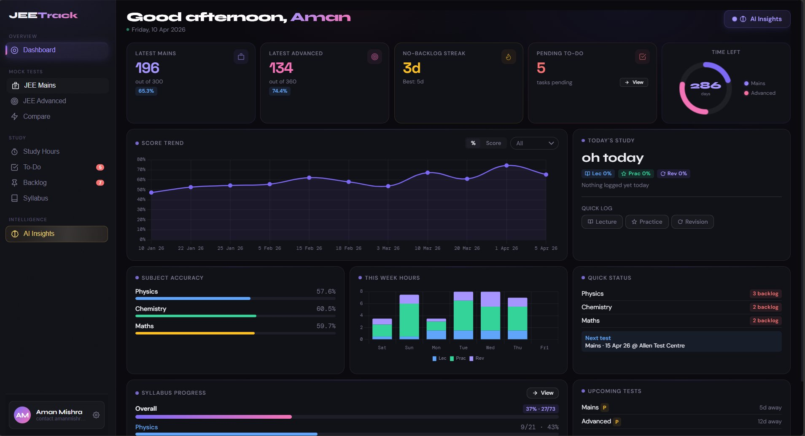
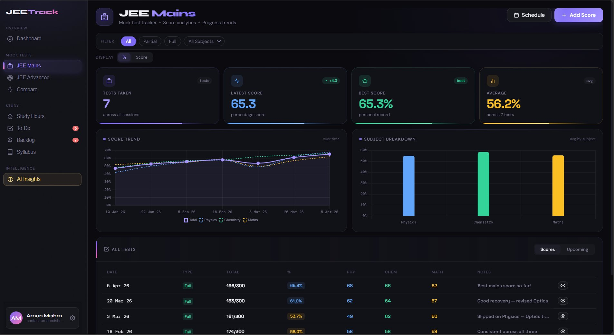
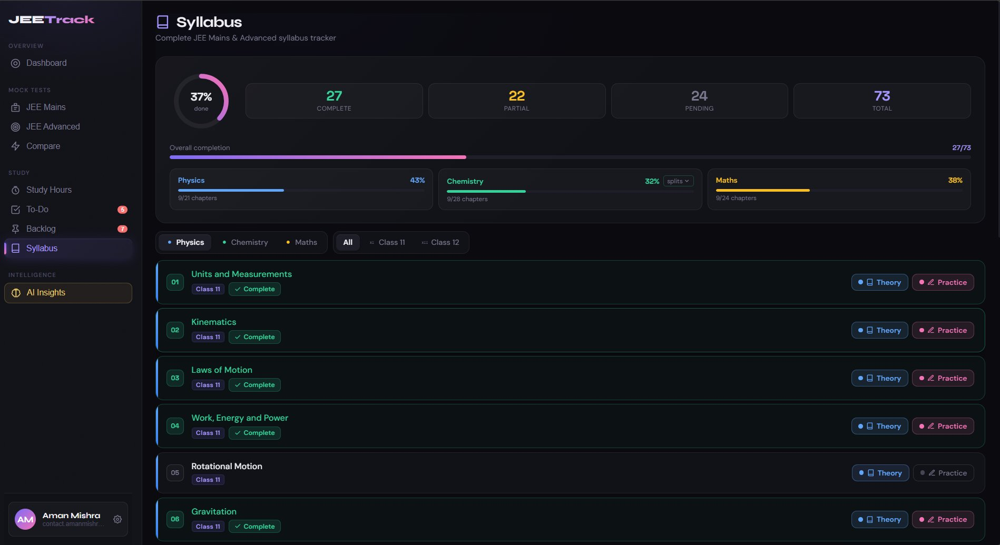
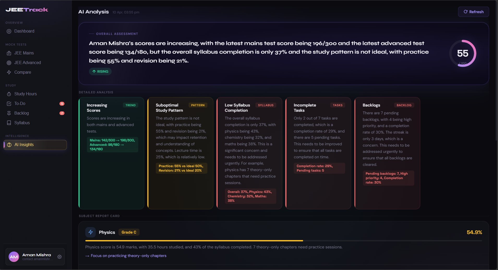
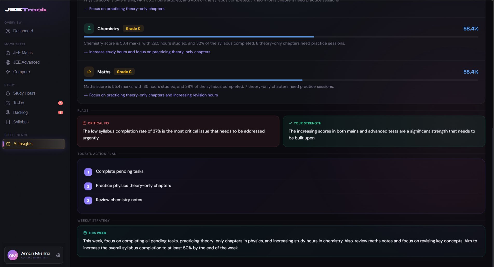

<div align="center">

<br/>


<br/>
<br/>

# JEETrack

### The all-in-one preparation tracker for JEE aspirants.

<br/>

[](https://jeetrack.in)

<br/>

[](https://supabase.com)
[](https://web.dev/progressive-web-apps/)
[](https://vercel.com)
[](LICENSE)

<br/>

> Track study hours · Analyse test scores · Crush the JEE syllabus — with AI-powered insights built in.

<br/>

</div>

---

<br/>

<div align="center">
  
  <br/><br/>
  <sub><i>Dashboard — daily study tracking, countdowns, score trends and subject progress at a glance</i></sub>
</div>

<br/>

---

<br/>

<div align="center">
  
  &nbsp;&nbsp;
  
  <br/><br/>
  <sub><i>JEE Mains &amp; Advanced test analytics &nbsp;·&nbsp; Topic-level syllabus coverage tracker</i></sub>
</div>

<br/>

<div align="center">
  
  &nbsp;&nbsp;
  
  <br/><br/>
  <sub><i>AI-powered coaching analysis &nbsp;·&nbsp; Personalised subject report &amp; action plan</i></sub>
</div>

<br/>

---

## ✨ Features

| | Feature | Description |
|---|---|---|
| 📊 | **Dashboard** | Daily study tracking, subject-wise progress, streak system & JEE countdown |
| 📝 | **Test Tracker** | Log JEE Mains / Advanced mock scores with trend charts and performance analytics |
| 📚 | **Syllabus Tracker** | Topic-level coverage across Physics, Chemistry & Maths |
| 🗂️ | **To-Do & Backlog** | Task management with priority levels and no-backlog streak |
| 🤖 | **AI Insights** | Personalised coaching analysis powered by **Groq (LLaMA 3.3 70B)** — pinpoints weak areas and suggests a plan |
| 📧 | **Monthly Reports** | Automated PDF report card delivered via email |
| 📱 | **PWA** | Installable on Android & iOS, works fully offline |
| 🔔 | **Push Notifications** | Daily study reminders via service worker |

---

## 🛠 Tech Stack

```
Frontend    Vanilla HTML · CSS · JavaScript 
Database    Supabase (PostgreSQL + Row Level Security)
Auth        Supabase Auth
Payments    Razorpay (checkout, webhooks, verification)
AI Engine   Groq API  (LLaMA 3.3 70B Versatile, ~0.5s latency)
Functions   Supabase Edge Functions  (Deno / TypeScript)
Email       Resend API
Charts      Chart.js
PDF         jsPDF + html2canvas
Hosting     Vercel
Cron        pg_cron (Supabase)
```

---

## 📁 Project Structure

```
jeetrack/
├── .github/
│   ├── ISSUE_TEMPLATE/
│   │   ├── bug_report.md
│   │   └── feature_request.md
│   └── PULL_REQUEST_TEMPLATE.md
├── docs/
│   ├── ARCHITECTURE.md                # System design & data flow
│   └── PERFORMANCE.md                 # Database IO investigation & fixes
├── frontend/                          # Static PWA — deployed to Vercel (Root Directory = frontend)
│   ├── index.html                     # Main app shell & markup
│   ├── app.js                         # All application logic
│   ├── styles.css                     # All styles
│   ├── analytics.js                   # Lightweight usage analytics
│   ├── sw.js                          # Service worker — MUST stay at this root
│   │                                  # (its scope is tied to its own path)
│   ├── manifest.json                  # PWA manifest
│   ├── robots.txt, sitemap.xml        # SEO — must be served at exact root path
│   ├── google*.html                   # Google Search Console verification
│   ├── vercel.json                    # Rewrites (clean URLs, SPA fallback, admin subdomain)
│   ├── api/                           # Serverless functions
│   │   ├── config.js                  #   → serves env vars to the frontend
│   │   └── admin.js                   #   → powers the admin dashboard API
│   ├── admin/
│   │   └── admin.html                 # Admin dashboard UI (served at /admin)
│   ├── pages/                         # Marketing / legal static pages
│   │   ├── about.html, faq.html, features.html,
│   │   ├── privacy.html, terms.html,
│   │   └── support.html, hall-of-support.html
│   └── assets/
│       └── icons/                     # Favicons, PWA icons, email logo
│           ├── favicon.svg, favicon.png
│           ├── icon-152.png, icon-192.png
│           └── jeetrack-logo-email.png
├── supabase/
│   └── functions/                     # Edge Functions (Deno / TypeScript)
│       ├── ai-insights/               # Groq AI analysis
│       ├── monthly-report/            # Monthly email + PDF report
│       ├── create-razorpay-order/     # Razorpay checkout
│       ├── verify-razorpay-payment/   # Razorpay payment verification
│       ├── razorpay-webhook/          # Razorpay webhook handler
│       ├── check-payment-status/      # Payment status polling
│       └── custom-email/              # Transactional email templates
├── database/
│   └── sql/                           # Reference SQL — schema + historical migrations
│       ├── supabase-schema.sql        # Full database schema
│       ├── migration.sql              # Core DB migration
│       ├── onboarding-trigger.sql     # New-user onboarding automation
│       ├── practice_log_supabase_schema.sql
│       ├── razorpay-and-fixes-migration.sql
│       ├── razorpay-security-hardening-migration.sql
│       └── review-migration.sql
├── screenshots/                       # README assets
├── LICENSE
├── CONTRIBUTING.md
└── README.md
```

> **Why `sw.js`, `manifest.json`, `robots.txt`, `sitemap.xml`, and the Google verification file stay at the `frontend/` root instead of moving into subfolders:** each of these has a hard requirement — from the browser spec, a search engine, or Google Search Console — to be served at an exact, unmoved URL path. Everything else that had no such constraint (icons, admin, marketing pages) has been organized into its own folder. Public URLs for every page and asset are unchanged (see `vercel.json`) — only where the files physically live on disk changed.

> **Note on `database/sql/`:** these are kept as reference/history, not an auto-applied migrations folder — they were run manually via the Supabase SQL Editor in the order listed in Quick Start below. If you manage schema changes with the Supabase CLI going forward, put new ones in `supabase/migrations/` instead so `supabase db push` picks them up automatically.

---

## 🚀 Quick Start

### 1 · Clone the repository

```bash
git clone https://github.com/AmanxMishraDev/JEETrack.git
cd JEETrack
```

### 2 · Set up Supabase

1. Create a project at [supabase.com](https://supabase.com)
2. Open **SQL Editor** and run `database/sql/supabase-schema.sql`
3. Run `database/sql/migration.sql` then `database/sql/onboarding-trigger.sql`
4. Copy your **Project URL** and **anon key** from **Settings → API**

### 3 · Configure the frontend

Credentials are **never hardcoded** in source code. The frontend fetches them at runtime from a Vercel serverless function (`/api/config`) which reads them from environment variables set in your Vercel dashboard.

Go to your Vercel project → **Settings → Environment Variables** and add:

| Variable | Value |
|---|---|
| `SUPABASE_URL` | `https://your-project.supabase.co` |
| `SUPABASE_ANON_KEY` | `your-anon-key` |

### 4 · Deploy to Vercel

1. Push the repo to GitHub
2. Go to [vercel.com](https://vercel.com) → **Add New Project**
3. Import your repository and set **Root Directory** to `frontend`
4. Click **Deploy** ✅

The `frontend/vercel.json` already handles SPA rewrites so all routes work on hard refresh.

### 5 · Deploy Edge Functions

```bash
# Install Supabase CLI
npm install -g supabase

# Login and link your project
supabase login
supabase link --project-ref your-project-ref

# Set secrets
supabase secrets set GROQ_API_KEY=gsk_your_groq_key
supabase secrets set APP_URL=https://your-app.vercel.app

# Deploy AI insights function
supabase functions deploy ai-insights

# Deploy monthly report function (optional)
supabase secrets set RESEND_API_KEY=re_your_resend_key
supabase secrets set FROM_EMAIL=reports@yourdomain.com
supabase functions deploy monthly-report
```

---

## 🔐 Environment Variables

### Vercel Dashboard (Project → Settings → Environment Variables)

| Variable | Description |
|---|---|
| `SUPABASE_URL` | Your Supabase project URL |
| `SUPABASE_ANON_KEY` | Your Supabase anon/public key |

These are served to the frontend securely at runtime via the `/api/config` serverless function — credentials are never stored in source code.

### Supabase Secrets (Edge Functions)

| Variable | Description |
|---|---|
| `GROQ_API_KEY` | Groq API key for AI insights |
| `RESEND_API_KEY` | Resend key for email reports |
| `FROM_EMAIL` | Sender address for reports |
| `APP_URL` | Your Vercel deployment URL (for CORS) |
| `RAZORPAY_KEY_ID` | Razorpay key ID (order creation, verification) |
| `RAZORPAY_KEY_SECRET` | Razorpay key secret |
| `RAZORPAY_WEBHOOK_SECRET` | Verifies incoming Razorpay webhook signatures |

---

## 📤 Pushing Updates to GitHub

```bash
git add .
git commit -m "feat: describe your change"
git push origin main
```

Vercel auto-deploys on every push — no manual steps needed.

> **Note:** GitHub no longer accepts passwords over HTTPS. Use a [Personal Access Token](https://github.com/settings/tokens) with `repo` scope when prompted for credentials.

---

## 📋 Roadmap

- [ ] Revision scheduler with spaced repetition
- [ ] Peer leaderboard (opt-in)
- [ ] JEE Previous Year Question tagging
- [ ] Offline AI insights (on-device model)

---

## 📚 Documentation

- [`docs/ARCHITECTURE.md`](docs/ARCHITECTURE.md) — how the pieces fit together
- [`docs/PERFORMANCE.md`](docs/PERFORMANCE.md) — Database IO investigation: what was consuming budget on the free tier and what was fixed

## 🤝 Contributing

This is a closed-source project (see [License](#-license) below) — it isn't open to public pull requests. See [`CONTRIBUTING.md`](CONTRIBUTING.md) if you've been given direct access to the repo.

---

## 👨‍💻 Author

**Aman Mishra** · [@AmanxMishraDev](https://github.com/AmanxMishraDev)

## 📄 License

All Rights Reserved — see [`LICENSE`](LICENSE). This code is not open source; viewing it does not grant permission to use, copy, or redistribute it.

---

<div align="center">

<br/>

**Built with ❤️ for every JEE aspirant who refuses to give up**

<br/>

⭐ &nbsp;Star this repo if JEETrack helped your preparation

<br/>
<br/>

[](https://jeetrack.in)

<br/>

</div>
